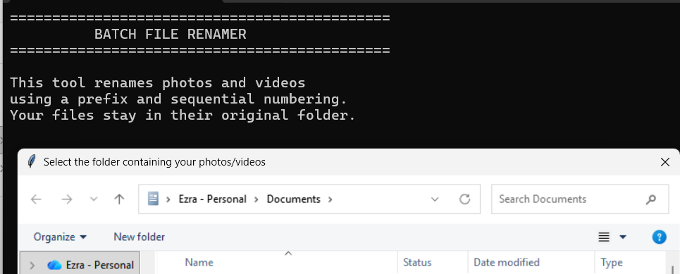
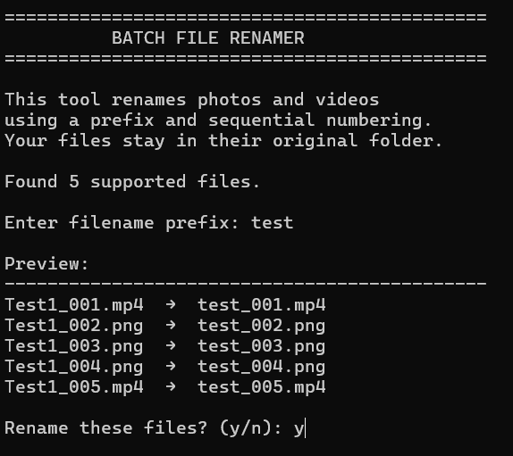

# Batch File Renamer

A simple Python utility for renaming large batches of photos and videos using consistent sequential filenames.

I built this project as a practical introduction to Python automation, file handling, and packaging Python programs into standalone Windows applications.

## What it does

The Batch File Renamer:

- Lets the user choose any folder using a Windows folder browser
- Finds supported photo and video files
- Ignores hidden files
- Sorts files consistently before renaming
- Lets the user choose a filename prefix
- Shows a preview before making changes
- Checks whether destination filenames already exist
- Renames files sequentially
- Shows progress while renaming
- Reports how many files were successfully renamed, and flags any that failed

### Supported file types

- `.jpg`
- `.jpeg`
- `.png`
- `.mp4`

## Example

Before:

    IMG_0001.JPG
    IMG_0002.JPG
    GX010001.MP4
    GX010002.MP4

The user enters:

    GoPro

The files become:

    GoPro_001.JPG
    GoPro_002.JPG
    GoPro_003.MP4
    GoPro_004.MP4

The original file extensions are preserved.

## How to use

### Option 1 — Windows executable

Download the latest `.exe` from the [Releases](../../releases) page and run it directly.

No Python installation is required.

1. Open the program.
2. Select the folder containing your photos/videos.
3. Enter a filename prefix.
4. Review the proposed changes.
5. Enter `y` or `yes` to confirm.
6. The files will be renamed in their original folder.

### Option 2 — Run the Python source code

Python is required.

Run:

    python batch_file_renamer.py

## Safety features

The program does not upload files or connect to the internet.

Before renaming, it:

- Shows a preview of the changes.
- Checks for existing destination filenames.
- Requires confirmation from the user.
- Sanitises the entered prefix to remove characters that aren't safe in filenames.

If a file can't be renamed (for example, it's open in another program or read-only), the program reports the failure and continues with the rest of the batch rather than stopping partway through.

The program only renames files. It does not move them to another folder.

## Limitations / planned improvements

- No undo — renames are immediate and not reversible. A dry-run mode and/or a rename log for manual undo is a planned improvement.
- No recursive folder support — only renames files in the top level of the selected folder, not subfolders.
- No GUI beyond the folder picker — everything else runs in the console.

## Project structure

    Batch-File-Renamer/
    ├── batch_file_renamer.py
    ├── README.md
    ├── .gitignore
    ├── screenshots/
    │   ├── folder-selection.png
    │   └── preview.png
    └── sample_files/
        └── .gitkeep

## Python concepts demonstrated

This project uses:

- `pathlib`
- File and folder handling
- List comprehensions
- Filtering files by extension
- Sorting
- `for` loops
- `enumerate()`
- String formatting
- User input
- Conditional statements
- Error handling with `try`/`except` for file operations
- Regex-based input sanitisation
- `tkinter` folder selection
- File renaming
- Basic program safety checks

## Why I built it

Site and drone photos often come off cameras with generic names like `IMG_0001.JPG`, making it hard to organise, QA, or hand over to clients quickly. This tool renames large batches into a consistent, sequential format in seconds — something I built after doing this manually, file by file, on real survey jobs.

It was also a practical way to build Python skills relevant to GIS, surveying, and data automation, as part of a broader portfolio pivoting toward geospatial analyst work.

## Screenshots

### Selecting a folder

### Previewing changes

